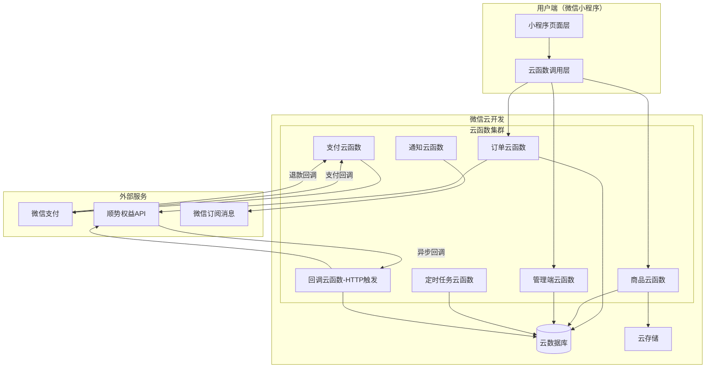
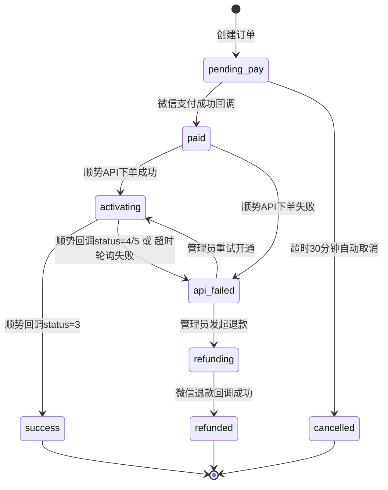
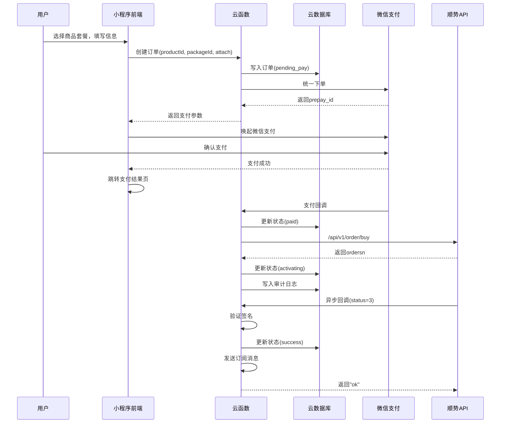
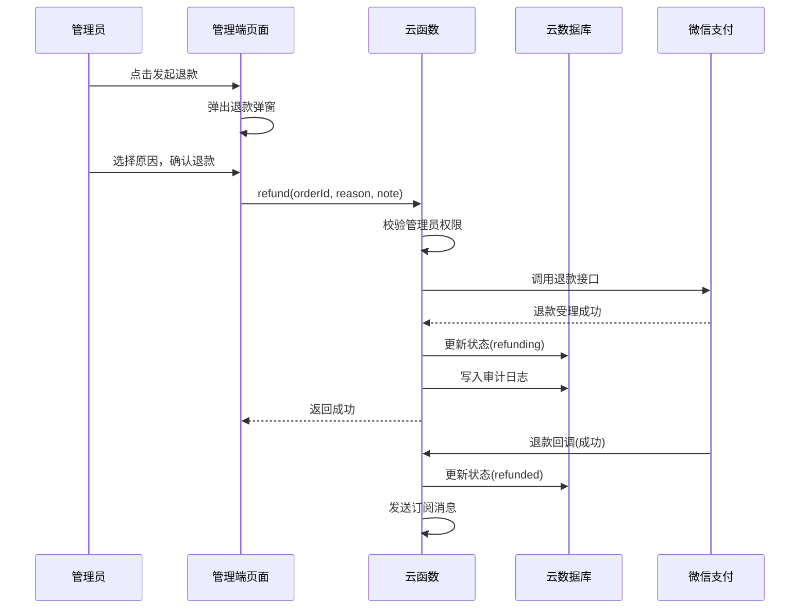

# Design Document: 会员多多购微信小程序

## Overview

"会员多多购"是一款基于微信云开发的虚拟会员代充微信小程序。系统采用无服务器架构（Serverless），前端使用微信小程序原生框架（WXML + WXSS + JS），后端完全依赖微信云开发能力（云函数 + 云数据库 + 云存储），通过对接顺势权益API实现会员自动开通，集成微信支付完成交易闭环。

### 核心目标

- 用户可浏览、搜索、购买各类虚拟会员商品
- 支付成功后系统自动调用顺势API完成会员开通
- 管理员可通过后台管理商品、处理异常订单、查看运营数据
- 全链路自动化，仅在异常场景需人工介入

### 技术选型

| 层面 | 技术方案 | 说明 |
|------|----------|------|
| 前端框架 | 微信小程序原生（WXML/WXSS/TypeScript） | 原生开发，兼容性最佳，TS提供类型安全 |
| UI组件库 | TDesign Miniprogram | 腾讯官方维护，提供Toast/Dialog/Tabs/Skeleton等基础组件 |
| 后端运行时 | 微信云开发云函数（Node.js 16+ / TypeScript） | 无需购买服务器和域名，TS约束入参出参 |
| 数据库 | 微信云开发云数据库（NoSQL） | 文档型数据库，类MongoDB |
| 文件存储 | 微信云开发云存储 | 存放静态资源、客服二维码等 |
| 支付 | 微信支付 API v3（小程序支付） | JSON格式、RSA签名、AES-GCM回调解密 |
| 第三方API | 顺势权益API | 商品同步、自动下单、状态回调 |
| 定时任务 | 云函数定时触发器 | 订单超时取消、开通超时轮询 |
| 外部回调 | 云函数HTTP触发（独立部署） | 接收顺势API异步回调通知，独立部署保证响应速度 |

### 技术选型说明

**为什么选 TypeScript：**
- 订单状态枚举（OrderStatus）用 TS enum 约束，减少拼写错误导致的状态流转 bug
- 云函数入参/出参有类型保护，编译期捕获错误
- 动态表单（attach 模板）的类型推导更安全
- 微信云开发官方已原生支持 TS 云函数

**为什么选 TDesign Miniprogram：**
- 腾讯官方维护，和微信小程序兼容性最佳，审核无风险
- 提供项目所需的核心组件：Toast、Dialog、ActionSheet、Tabs、Cell、Skeleton、Tag、Badge等
- 减少 40%+ 的样式编写，专注业务逻辑
- 设计规范可自定义主题色（适配我们的金色 #c99a3a 品牌色）

**为什么选微信支付 API v3：**
- 使用 JSON 格式（取代旧版 XML），与云函数 Node.js 天然兼容
- RSA 非对称签名（比旧版 MD5/HMAC-SHA256 更安全）
- 回调通知使用 AES-256-GCM 加密，防篡改
- 微信官方推荐，旧版 v2 逐步停止维护

---

## Architecture

### 系统架构图



### 云函数分层架构

> **部署策略**：支付回调（payCallback）、退款回调（refundCallback）和顺势回调（callback）作为独立云函数部署，保证冷启动速度和响应时效。其余按模块聚合，通过 action 路由分发。

```
cloudfunctions/
├── order/              # 订单业务云函数
│   ├── index.ts        # 入口路由
│   ├── create.ts       # 创建订单
│   ├── query.ts        # 查询订单
│   ├── refresh.ts      # 刷新订单状态
│   └── list.ts         # 订单列表
├── product/            # 商品业务云函数
│   ├── index.ts
│   ├── list.ts         # 商品列表
│   ├── detail.ts       # 商品详情
│   ├── search.ts       # 商品搜索
│   └── sync.ts         # 商品同步
├── payCallback/        # 支付回调云函数（独立部署）
│   └── index.ts        # 微信支付成功回调 + 调顺势下单
├── refundCallback/     # 退款回调云函数（独立部署）
│   └── index.ts        # 微信退款回调处理
├── callback/           # 顺势回调云函数（HTTP触发，独立部署）
│   └── index.ts        # 回调接收与验签
├── payment/            # 支付业务云函数
│   ├── index.ts
│   ├── unifiedOrder.ts # 统一下单
│   └── refund.ts       # 退款发起
├── timer/              # 定时任务云函数
│   ├── index.ts
│   ├── cancelExpired.ts    # 超时取消
│   └── queryPending.ts     # 开通超时轮询
├── admin/              # 管理端云函数
│   ├── index.ts
│   ├── dashboard.ts    # 数据看板
│   ├── orderManage.ts  # 订单管理
│   ├── productManage.ts# 商品管理
│   └── auditLog.ts     # 审计日志
├── notify/             # 通知云函数
│   └── index.ts        # 订阅消息发送
└── shared/             # 共享模块（被其他云函数引用）
    ├── types/          # TypeScript 类型定义
    │   ├── order.ts    # 订单状态枚举等
    │   ├── product.ts  # 商品数据类型
    │   └── api.ts      # API响应类型
    ├── utils/
    │   ├── shunshi.ts  # 顺势API封装
    │   ├── sign.ts     # 签名工具
    │   ├── mask.ts     # 脱敏工具
    │   └── logger.ts   # 审计日志工具
    └── constants.ts    # 常量定义
```

### 前端页面结构

```
miniprogram/
├── pages/
│   ├── index/          # 首页
│   ├── category/       # 分类页
│   ├── search/         # 搜索结果页
│   ├── detail/         # 商品详情页
│   ├── pay-result/     # 支付结果页
│   ├── orders/         # 我的订单列表页
│   ├── order-detail/   # 订单详情页
│   ├── profile/        # 个人中心页
│   ├── article/        # 富文本内容页
│   └── admin/          # 管理端页面
│       ├── dashboard/  # 数据看板
│       ├── orders/     # 订单处理
│       ├── products/   # 商品运营
│       ├── product-edit/# 商品编辑
│       └── order-detail/# 管理端订单详情
├── components/
│   ├── product-card/   # 商品卡片
│   ├── order-card/     # 订单卡片
│   ├── timeline/       # 时间轴
│   ├── skeleton/       # 骨架屏（或直接使用TDesign Skeleton）
│   ├── empty-state/    # 空状态
│   ├── broadcast/      # 购买播报
│   ├── confirm-dialog/ # 确认弹窗（封装TDesign Dialog）
│   └── dynamic-form/   # 动态表单（基于attach模板）
├── utils/
│   ├── request.ts      # 云函数调用封装
│   ├── format.ts       # 格式化工具（脱敏、时间等）
│   ├── validator.ts    # 表单校验
│   ├── constants.ts    # 常量定义
│   └── types.ts        # 全局类型定义
├── typings/            # TypeScript类型声明
│   └── index.d.ts
└── app.ts / app.json / app.wxss
```

---

## Components and Interfaces

### 1. 云函数接口设计

#### 1.1 商品模块（product 云函数）

| 操作 | action | 入参 | 出参 |
|------|--------|------|------|
| 商品列表 | getList | { categoryId, page, pageSize } | { list, total } |
| 商品详情 | getDetail | { productId } | { product, packages } |
| 搜索商品 | search | { keyword, sort, page, pageSize } | { list, total } |
| 分类列表 | getCategories | {} | { categories } |
| 播报数据 | getBroadcast | {} | { list } |
| 获取系统配置 | getConfig | { key } | { value } |
| 富文本内容页 | getArticle | { key } | { title, content } |
| 同步商品（管理） | syncProducts | {} | { added, updated, offlined, duration } |

#### 1.2 订单模块（order 云函数）

| 操作 | action | 入参 | 出参 |
|------|--------|------|------|
| 创建订单 | create | { productId, packageId, attach } | { orderId, payParams } |
| 订单列表 | list | { status, page, pageSize } | { list, total } |
| 订单详情 | detail | { orderId } | { order, timeline, failReason } |
| 刷新进度 | refresh | { orderId } | { order, timeline } |
| 再买一次验证 | rebuyCheck | { productId, packageId } | { available, product } |
| 用户订单统计 | stats | {} | { total, activating, refunding } |

#### 1.3 支付模块（payment 云函数）

| 操作 | action | 入参 | 出参 |
|------|--------|------|------|
| 统一下单 | unifiedOrder | { orderId } | { payParams } |
| 支付回调 | payCallback | （微信POST） | XML响应 |
| 退款 | refund | { orderId, reason, note } | { success } |
| 退款回调 | refundCallback | （微信POST） | XML响应 |

#### 1.4 管理端模块（admin 云函数）

| 操作 | action | 入参 | 出参 |
|------|--------|------|------|
| 数据看板 | dashboard | {} | { stats, chart, ranking } |
| 管理订单列表 | orderList | { status, page, pageSize } | { list, total } |
| 管理订单详情 | orderDetail | { orderId } | { order, timeline, logs } |
| 重试开通 | retryActivation | { orderId } | { success, msg } |
| 查询接口状态 | queryShunshi | { orderId } | { shunshiStatus } |
| 发起退款 | initiateRefund | { orderId, reason, note } | { success } |
| 商品列表 | productList | { status } | { list, stats } |
| 商品编辑保存 | productSave | { product } | { success } |
| 上下架切换 | toggleOnline | { productId, online } | { success } |
| 审计日志 | auditLogs | { page, pageSize } | { list, total } |
| 更新系统配置 | updateConfig | { key, value } | { success } |
| 获取系统配置列表 | getConfigs | {} | { configs } |

#### 1.5 回调模块（callback 云函数 - HTTP触发）

| 触发方式 | 路径 | 说明 |
|----------|------|------|
| HTTP POST | /shunshi-callback | 顺势权益异步回调接收 |

#### 1.6 定时任务模块（timer 云函数）

| 定时规则 | 任务 | 说明 |
|----------|------|------|
| 每5分钟 | cancelExpiredOrders | 扫描并取消超时30分钟未支付订单 |
| 每5分钟 | queryPendingOrders | 查询超10分钟未回调的开通中订单 |

#### 1.7 通知模块（notify 云函数）

| 操作 | action | 入参 | 出参 |
|------|--------|------|------|
| 发送通知 | send | { openid, templateId, data, orderId } | { success } |

### 2. 顺势API调用封装

```javascript
// utils/shunshi.js - 云函数内部模块
class ShunshiClient {
  constructor() {
    this.baseUrl = 'https://www.mxmm666.com';
    this.userId = process.env.SHUNSHI_USER_ID;   // 环境变量
    this.apikey = process.env.SHUNSHI_API_KEY;    // 环境变量
  }

  // 生成签名
  generateSign(timestamp, body) {
    const sortedBody = sortObjectKeys(body);
    const jsonStr = JSON.stringify(sortedBody);
    const raw = timestamp + jsonStr + this.apikey;
    return sha1(raw);
  }

  // 验证回调签名
  verifyCallbackSign(params) {
    const { sign, card_list, express_list, time, ...rest } = params;
    const sorted = sortObjectKeys(rest);
    const jsonStr = JSON.stringify(sorted);
    const expected = sha1(time + jsonStr + this.apikey);
    return expected === sign;
  }

  // 统一请求方法
  async request(path, body = {}) { /* ... */ }

  // 获取分类列表
  async getCategories() { /* ... */ }

  // 获取商品列表
  async getProductList(params) { /* ... */ }

  // 获取商品详情
  async getProductDetail(id) { /* ... */ }

  // 提交订单
  async submitOrder(params) { /* ... */ }

  // 查询订单
  async queryOrder(params) { /* ... */ }
}
```

### 3. 前端组件接口

#### 3.1 动态表单组件（dynamic-form）

```javascript
// components/dynamic-form/dynamic-form.js
Component({
  properties: {
    // 顺势API返回的attach模板
    attachTemplate: { type: Array, value: [] },
    // 表单值
    formValues: { type: Object, value: {} }
  },
  methods: {
    // 表单值变更事件
    onFieldChange(e) { /* 触发 change 事件 */ },
    // 校验表单
    validate() { /* 返回 { valid, errors } */ }
  }
})
```

#### 3.2 购买播报组件（broadcast）

```javascript
// components/broadcast/broadcast.js
Component({
  properties: {
    // 播报数据列表
    dataList: { type: Array, value: [] },
    // 切换间隔（毫秒）
    interval: { type: Number, value: 4000 }
  }
})
```

---

## Data Models

### 云数据库集合设计

#### 1. orders（订单集合）

```javascript
{
  _id: String,                    // 云数据库自动生成
  orderId: String,                // 系统订单号（唯一，格式：VIP + 时间戳 + 随机4位）
  openid: String,                 // 用户openid
  productId: String,              // 商品ID（本地）
  productName: String,            // 商品名称（冗余，下单时快照）
  packageId: String,              // 套餐ID
  packageName: String,            // 套餐名称（冗余）
  categoryName: String,           // 分类名称（冗余）
  attach: Object,                 // 用户填写的开通参数 { recharge_account: "138xxx" }
  amount: Number,                 // 用户实付金额（分）
  costPrice: Number,              // 接口成本价（分）
  status: String,                 // 订单状态枚举
  // 状态枚举: pending_pay | paid | activating | success | api_failed | refunding | refunded | cancelled
  shunshiOrderSn: String,        // 顺势订单号
  shunshiGoodsId: Number,        // 顺势商品ID（下单时使用）
  shunshiStatus: Number,         // 顺势状态码
  rechargeHints: String,         // 顺势返回的充值提示
  failReason: String,            // 失败原因
  refundReason: String,          // 退款原因分类
  refundNote: String,            // 退款补充说明
  retryCount: Number,            // 重试次数（默认0，最大3）
  payTransactionId: String,      // 微信支付交易号
  refundId: String,              // 微信退款单号
  timeline: [                    // 状态时间轴
    { status: String, time: Date, desc: String }
  ],
  createdAt: Date,               // 创建时间
  paidAt: Date,                  // 支付时间
  activatedAt: Date,             // 开通成功时间
  refundedAt: Date,              // 退款时间
  cancelledAt: Date,             // 取消时间
  updatedAt: Date                // 最后更新时间
}
```

**索引设计：**
- `openid + status + createdAt`（用户订单列表查询）
- `status + createdAt`（管理端订单列表、定时任务扫描）
- `orderId`（唯一索引，订单号查询）
- `shunshiOrderSn`（顺势订单号查询）

#### 2. products（商品集合）

```javascript
{
  _id: String,
  productId: String,              // 本地商品ID（唯一）
  shunshiGoodsId: Number,        // 顺势商品ID
  name: String,                   // 展示名称（管理员自定义）
  shunshiName: String,           // 顺势原始名称
  categoryId: String,            // 所属分类ID
  categoryName: String,          // 分类名称（冗余）
  brandIcon: String,             // 品牌图标URL
  shunshiImg: String,            // 顺势商品图片
  tags: [String],                // 标签（如 "TV端"、"热销"）
  description: String,           // 一句话描述（分类页展示用）
  rechargeMethod: String,        // 充值方式（phone/account/card/other）
  accountType: String,           // 账号类型描述
  autoActivate: Boolean,         // 是否自动开通（默认true）
  online: Boolean,               // 上架状态
  sortWeight: Number,            // 排序权重（0-9999，越小越前）
  salesCount: Number,            // 累计销量
  todaySales: Number,            // 今日销量
  shunshiStatus: Number,         // 顺势商品状态（1/2/3）
  stockNum: Number,              // 库存
  attachTemplate: Array,         // 下单模板（来自顺势attach）
  packages: [                    // 套餐列表
    {
      packageId: String,         // 套餐ID
      name: String,              // 套餐名称（如"月卡"、"季卡"）
      memberType: String,        // 会员类型（如"黄金VIP"、"白银VIP"）
      price: Number,             // 售价（分）
      costPrice: Number,         // 接口成本（分）
      faceValue: Number,         // 面值/原价（分）
      shunshiGoodsId: Number,    // 对应顺势商品ID
      stock: Number,             // 库存（-1=无限）
      online: Boolean,           // 套餐上架状态
      isDefault: Boolean,        // 是否默认套餐
      sortWeight: Number         // 套餐排序
    }
  ],
  rules: {                       // 售前规则
    deviceSupport: String,       // 设备支持说明
    arrivalTime: String,         // 到账时间说明
    safetyNote: String           // 安全说明
  },
  createdAt: Date,
  updatedAt: Date
}
```

**索引设计：**
- `categoryId + online + sortWeight`（分类商品列表）
- `online + sortWeight`（首页商品列表）
- `shunshiGoodsId`（同步时匹配）
- `name`（文本索引，搜索用）

#### 3. categories（分类集合）

```javascript
{
  _id: String,
  categoryId: String,            // 本地分类ID
  shunshiCateId: Number,         // 顺势分类ID
  name: String,                  // 分类名称
  icon: String,                  // 分类图标URL
  parentId: String,              // 父级分类ID（空为顶级）
  level: Number,                 // 层级（1/2/3）
  sortWeight: Number,            // 排序权重
  productCount: Number,          // 分类下商品数量
  showInTab: Boolean,            // 是否在首页Tab显示
  tabSort: Number,               // Tab排序
  createdAt: Date,
  updatedAt: Date
}
```

#### 4. admin_whitelist（管理员白名单集合）

```javascript
{
  _id: String,
  openid: String,                // 管理员微信openid（唯一）
  nickname: String,              // 备注昵称
  addedBy: String,               // 添加人openid
  createdAt: Date
}
```

#### 5. audit_logs（审计日志集合）

```javascript
{
  _id: String,
  logId: String,                 // 日志ID
  type: String,                  // 操作类型枚举
  // 枚举: order_create | order_pay | shunshi_submit | shunshi_callback |
  //       status_update | retry_activation | refund_initiate | refund_success |
  //       order_cancel | product_sync | product_update | admin_login
  operator: String,              // 操作人（openid 或 "system"）
  operatorName: String,          // 操作人名称
  orderId: String,               // 关联订单号（可空）
  productId: String,             // 关联商品ID（可空）
  action: String,                // 动作描述
  detail: Object,                // 详细信息
  // detail 结构示例：
  // { requestPath: "/api/v1/order/buy", httpStatus: 200, bizCode: 200, duration: 350 }
  result: String,                // 结果（success / failed）
  errorCode: String,             // 错误码（失败时）
  errorMsg: String,              // 错误信息（失败时）
  note: String,                  // 备注（最大200字符）
  createdAt: Date                // ISO 8601 精确到毫秒
}
```

**索引设计：**
- `createdAt`（时间倒序查询）
- `orderId + createdAt`（订单关联日志）
- `type + createdAt`（按类型筛选）

#### 6. system_config（系统配置集合）

```javascript
{
  _id: String,
  key: String,                   // 配置键（唯一）
  value: Any,                    // 配置值
  desc: String,                  // 配置说明
  updatedAt: Date
}
// 预设配置项：
// { key: "homepage_order_count", value: "8.2万+", desc: "首页累计订单数展示" }
// { key: "customer_service_qrcode", value: "cloud://xxx.png", desc: "客服二维码图片" }
// { key: "purchase_notice", value: "<rich text>", desc: "购买须知" }
// { key: "account_guide", value: "<rich text>", desc: "账号填写说明" }
// { key: "platform_announcement", value: "<rich text>", desc: "平台公告" }
```

#### 7. broadcast_cache（播报缓存集合）

```javascript
{
  _id: String,
  phone: String,                 // 脱敏手机号
  productName: String,           // 商品名称
  createdAt: Date                // 开通成功时间
}
// 仅保留最近20条，由订单状态更新时自动维护
```

### 订单状态机



---


## Correctness Properties

*A property is a characteristic or behavior that should hold true across all valid executions of a system-essentially, a formal statement about what the system should do. Properties serve as the bridge between human-readable specifications and machine-verifiable correctness guarantees.*

### Property 1: 分类过滤正确性

*For any* 商品集合和任意分类ID，商品列表过滤函数返回的结果中，每个商品的 categoryId 都等于指定分类ID，且 online 字段为 true。

**Validates: Requirements 1.2, 1.5**

### Property 2: 动态表单渲染一致性

*For any* 合法的 Attach_Template 数组，动态表单渲染函数生成的表单字段数量等于模板数组长度，且每个字段的 type 和 key 与模板对应项一致。

**Validates: Requirements 2.4**

### Property 3: 手机号格式校验正确性

*For any* 字符串，手机号校验函数返回 true 当且仅当该字符串匹配正则 `^1[3-9]\d{9}$`（11位大陆手机号）。

**Validates: Requirements 2.5, 16.5**

### Property 4: 表单完整性与按钮状态联动

*For any* Attach_Template 和任意表单填写状态，当且仅当所有必填字段（template 中的每个项）都有非空值时，购买按钮状态才为可用（enabled）。

**Validates: Requirements 2.6**

### Property 5: 订单金额锁定不变量

*For any* 已创建的订单，无论后续套餐价格如何变更，该订单的 amount 字段始终等于创建时锁定的金额。

**Validates: Requirements 3.7**

### Property 6: Safe_Price 等于用户实付金额

*For any* 调用顺势API下单的请求，safe_price 参数的值必须等于对应订单的用户实付金额（order.amount）。

**Validates: Requirements 4.3**

### Property 7: 签名生成与验证 Round-Trip

*For any* 合法的请求参数对象（key为字符串，value为字符串或数字）、任意13位时间戳和任意apikey，使用签名生成函数产生的 sign 值必须能通过签名验证函数的校验。即 `verifySign(params, generateSign(timestamp, params, apikey), timestamp, apikey) === true`。

**Validates: Requirements 5.2, 14.1**

### Property 8: 请求 Header 格式正确性

*For any* 发往顺势API的请求，Header 中 Sign 字段为40位小写十六进制字符串，Timestamp 为13位数字字符串，UserId 为非空字符串。

**Validates: Requirements 14.2**

### Property 9: 日志不含敏感信息

*For any* 审计日志记录，其所有字段的字符串值中不包含 apikey 原文、不包含完整的40位签名值、不包含未脱敏的11位手机号。

**Validates: Requirements 14.4**

### Property 10: 白名单权限校验一致性

*For any* openid 和任意 admin_whitelist 集合，权限校验函数返回 "允许" 当且仅当该 openid 存在于 whitelist 集合中；否则返回 "拒绝"。

**Validates: Requirements 12.3, 12.4**

### Property 11: 审计日志字段完整性

*For any* 审计日志记录事件（无论管理员操作还是系统自动操作），生成的日志对象必须包含 operator、createdAt（ISO 8601毫秒精度）、type 和 action 字段，且 createdAt 为合法的 ISO 8601 格式。

**Validates: Requirements 13.1, 13.2**

### Property 12: 11位手机号脱敏格式

*For any* 11位数字字符串（手机号），脱敏函数的输出格式为：前3位原文 + "****" + 后4位原文，总长度为11。

**Validates: Requirements 15.1, 15.3**

### Property 13: 非手机号格式脱敏规则

*For any* 长度≥5且非11位纯数字的字符串，脱敏函数的输出为：首2位原文 + 星号（数量=原长度-4）+ 末2位原文。对长度<5的字符串，直接全部用星号替代。

**Validates: Requirements 15.5**

### Property 14: 商品同步保留管理员配置

*For any* 已存在的商品记录，执行同步操作后，管理员自定义的字段（name、sortWeight、online（当上游status=1时）、packages[].price）保持不变，仅更新来自顺势API的字段（shunshiName、costPrice、stockNum、shunshiStatus）。

**Validates: Requirements 17.3**

### Property 15: 搜索匹配正确性

*For any* 关键词和商品集合，搜索函数返回的每个商品的名称或分类名称必须包含该关键词（不区分大小写），且每个返回商品的 online 字段为 true。

**Validates: Requirements 1.6, 21.2**

### Property 16: 价格排序单调性

*For any* 商品列表，按"价格低"排序后，结果列表中每个商品的默认套餐售价 ≤ 下一个商品的默认套餐售价（单调递增）。

**Validates: Requirements 21.5**

### Property 17: 标签过滤正确性

*For any* 商品集合，使用"电视端"筛选后，返回列表中每个商品的 tags 数组必须包含 "TV端" 标签。

**Validates: Requirements 21.6**

### Property 18: 订单超时判断正确性

*For any* 订单记录，当状态为 pending_pay 且 createdAt 距当前时间超过30分钟时，超时判断函数返回 true；否则返回 false。

**Validates: Requirements 23.1**

### Property 19: 用户端排除已取消订单

*For any* 用户订单列表查询结果，返回列表中不存在 status 为 "cancelled" 的订单。

**Validates: Requirements 23.4**

### Property 20: 套餐选择与金额同步

*For any* 套餐列表和用户选择的套餐索引，支付栏显示的金额必须等于所选套餐的 price 字段值。

**Validates: Requirements 2.3**

---

## Error Handling

### 错误分层策略

| 层级 | 处理方式 | 用户感知 |
|------|----------|----------|
| 前端网络层 | 统一拦截超时/断网，展示异常提示+重试按钮 | 看到网络异常提示 |
| 云函数业务层 | 捕获异常，返回标准错误结构 | 看到对应业务提示 |
| 第三方API层 | 记录日志，状态降级，不自动重试 | 看到"处理中"或"失败" |
| 数据库层 | 重试1次，仍失败则记录云函数日志 | 无感知（后台） |

### 标准错误响应结构

```javascript
{
  success: false,
  errCode: 'ORDER_NOT_FOUND',    // 业务错误码
  errMsg: '订单不存在',            // 用户友好提示
  detail: {}                      // 开发调试信息（仅开发环境返回）
}
```

### 核心错误场景处理

#### 1. 微信支付相关

| 场景 | 处理 | 用户体验 |
|------|------|----------|
| 统一下单失败 | 记录日志，返回错误 | 提示"支付发起失败，请重试" |
| 支付回调签名校验失败 | 拒绝处理，记录告警 | 无感知 |
| 退款接口调用失败 | 记录日志，管理员可重试 | 管理员看到失败提示 |

#### 2. 顺势API相关

| 场景 | 处理 | 用户体验 |
|------|------|----------|
| 下单返回非200 | 订单设为api_failed，记录错误码 | 看到"开通失败" |
| 下单网络超时(>15s) | 标记失败，不自动重试 | 看到"开通失败" |
| 回调签名验证失败 | 拒绝处理，记录异常日志 | 无感知 |
| 回调超10分钟未到 | 定时任务主动查询 | 无感知（状态自动更新） |
| 商品同步中途失败 | 中止，保留已同步数据 | 管理员看到部分同步结果 |

#### 3. 数据库相关

| 场景 | 处理 | 用户体验 |
|------|------|----------|
| 审计日志写入失败 | 重试1次，仍失败输出到云函数日志 | 无感知 |
| 白名单查询失败 | 默认拒绝访问 | 管理员暂时无法进入后台 |
| 订单创建冲突 | 基于orderId唯一索引去重 | 无感知 |

#### 4. 前端相关

| 场景 | 处理 | 用户体验 |
|------|------|----------|
| 页面加载超10秒 | 从骨架屏切换为异常提示 | 看到重试按钮 |
| 连续重试3次失败 | 追加客服入口引导 | 看到联系客服提示 |
| 表单校验失败 | 红色提示文案，阻止提交 | 看到校验错误提示 |
| 商品已下架 | 弹窗提示，引导返回 | 看到下架提示 |

### 幂等性设计

| 操作 | 幂等策略 |
|------|----------|
| 创建订单 | orderId 唯一索引防重 |
| 支付回调 | 判断订单状态，已处理则跳过 |
| 顺势回调 | 判断订单状态，已处理则返回ok |
| 退款操作 | 判断订单状态，非api_failed则拒绝 |
| 商品同步 | 基于 shunshiGoodsId 匹配更新 |


---

## Testing Strategy

### 测试框架选型

| 类型 | 工具 | 说明 |
|------|------|------|
| 单元测试 | Jest | 云函数业务逻辑测试 |
| Property-Based Testing | fast-check | 配合 Jest 使用，验证通用属性 |
| 集成测试 | Jest + Mock | Mock 外部服务（微信支付、顺势API）|
| 前端测试 | miniprogram-simulate | 小程序组件测试 |

### 双测试策略

本项目采用单元测试 + 属性测试双轨并行策略：

- **单元测试（Example-Based）**：验证具体场景、边界条件、集成点和错误处理
- **属性测试（Property-Based）**：验证通用逻辑正确性，覆盖大量随机输入

### Property-Based Testing 配置

```javascript
// jest.config.js 中的 PBT 配置
const fc = require('fast-check');

// 每个 property test 最少运行 100 次
fc.configureGlobal({ numRuns: 100 });
```

### 属性测试清单

每个属性测试必须引用设计文档中的对应 Property，标签格式：

```javascript
// Feature: vip-miniprogram, Property 7: 签名round-trip
test('签名生成后验证应通过', () => {
  fc.assert(fc.property(
    fc.dictionary(fc.string(), fc.oneof(fc.string(), fc.integer())),
    fc.string({ minLength: 13, maxLength: 13 }),
    fc.string({ minLength: 16, maxLength: 32 }),
    (body, timestamp, apikey) => {
      const sign = generateSign(timestamp, body, apikey);
      expect(verifySign(body, sign, timestamp, apikey)).toBe(true);
    }
  ));
});
```

### 测试文件组织

```
tests/
├── unit/
│   ├── utils/
│   │   ├── sign.test.js          # 签名生成/验证（Property 7, 8）
│   │   ├── mask.test.js          # 脱敏函数（Property 12, 13）
│   │   ├── validator.test.js     # 校验函数（Property 3）
│   │   └── filter.test.js        # 过滤/排序函数（Property 1, 15, 16, 17）
│   ├── order/
│   │   ├── timeout.test.js       # 超时判断（Property 18）
│   │   ├── amount.test.js        # 金额锁定（Property 5, 6）
│   │   └── status.test.js        # 状态过滤（Property 19）
│   ├── product/
│   │   ├── sync.test.js          # 同步保留配置（Property 14）
│   │   └── form.test.js          # 动态表单（Property 2, 4, 20）
│   ├── admin/
│   │   ├── auth.test.js          # 权限校验（Property 10）
│   │   └── audit.test.js         # 审计日志（Property 9, 11）
│   └── properties/
│       └── all-properties.test.js # 所有属性测试汇总
├── integration/
│   ├── payment.test.js           # 微信支付流程（Mock）
│   ├── shunshi.test.js           # 顺势API调用（Mock）
│   ├── callback.test.js          # 回调处理流程
│   └── order-flow.test.js        # 订单完整流程
└── components/
    ├── dynamic-form.test.js      # 动态表单组件
    ├── product-card.test.js      # 商品卡片
    └── broadcast.test.js         # 播报组件
```

### 集成测试重点场景

1. **支付完整流程**：统一下单 → 支付回调 → 顺势下单 → 顺势回调 → 状态更新
2. **退款流程**：管理员发起退款 → 微信退款接口 → 退款回调 → 状态更新
3. **超时处理**：订单超时30分钟 → 定时任务扫描 → 自动取消
4. **开通超时**：开通超过10分钟 → 定时任务轮询 → 查询顺势状态
5. **重试开通**：管理员重试 → 调用顺势API → 记录重试次数 → 最多3次

### 测试覆盖目标

| 模块 | 目标覆盖率 | 重点 |
|------|-----------|------|
| 签名/验签工具 | ≥95% | 安全关键路径 |
| 脱敏/校验工具 | ≥95% | 数据保护 |
| 订单状态机 | ≥90% | 核心业务逻辑 |
| 权限校验 | ≥90% | 安全关键 |
| 云函数业务逻辑 | ≥80% | 主流程 |
| 前端组件 | ≥70% | 关键交互组件 |

---

## 附录：核心流程时序图

### 用户购买完整流程



### 退款流程


